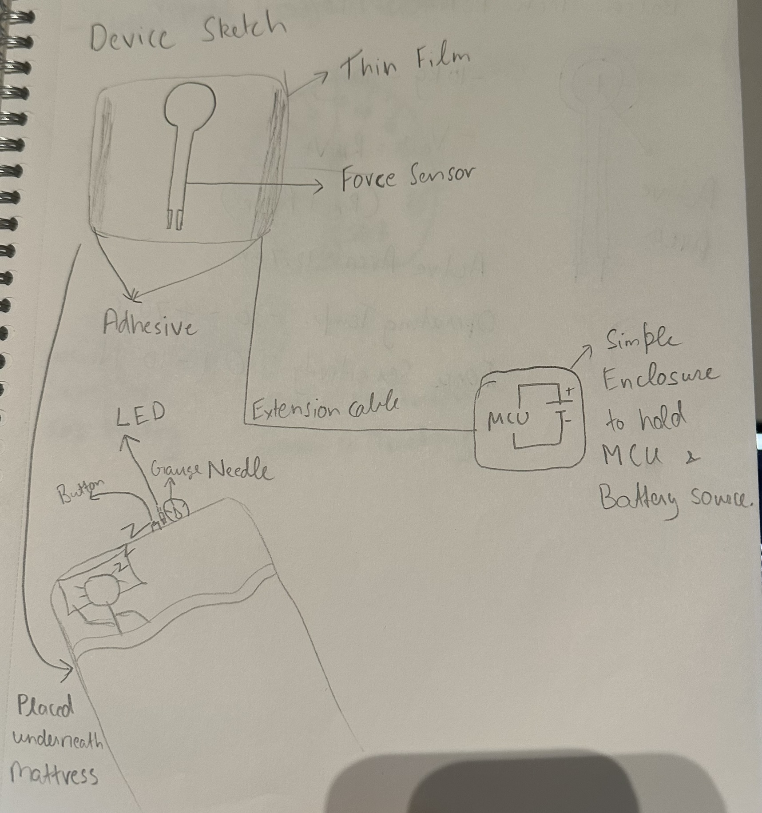
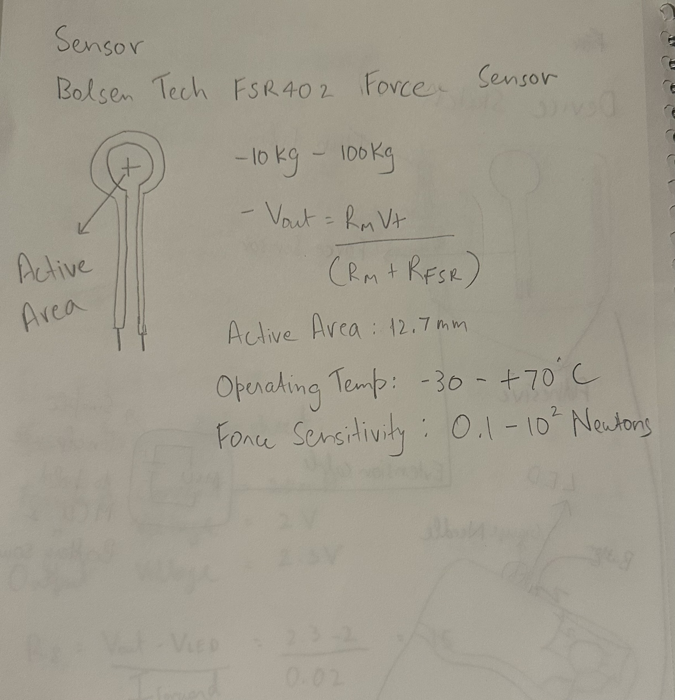
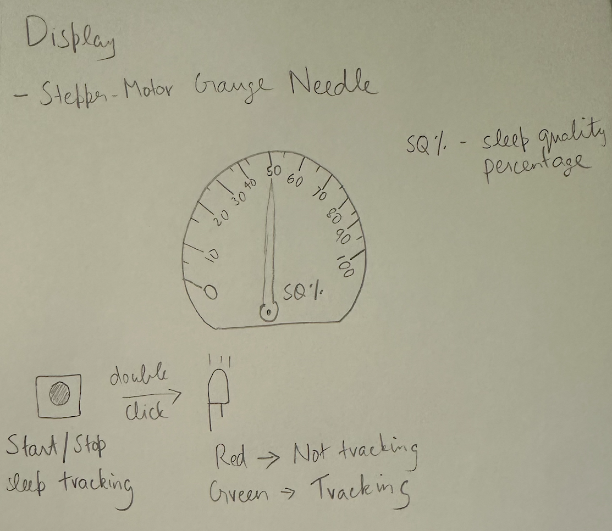
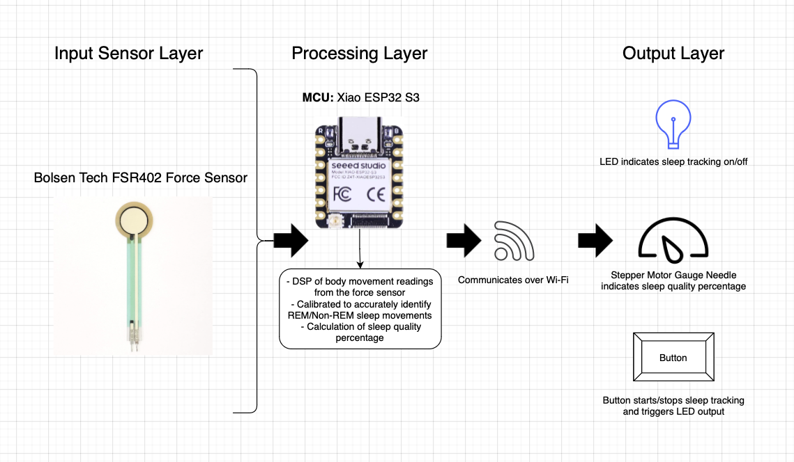
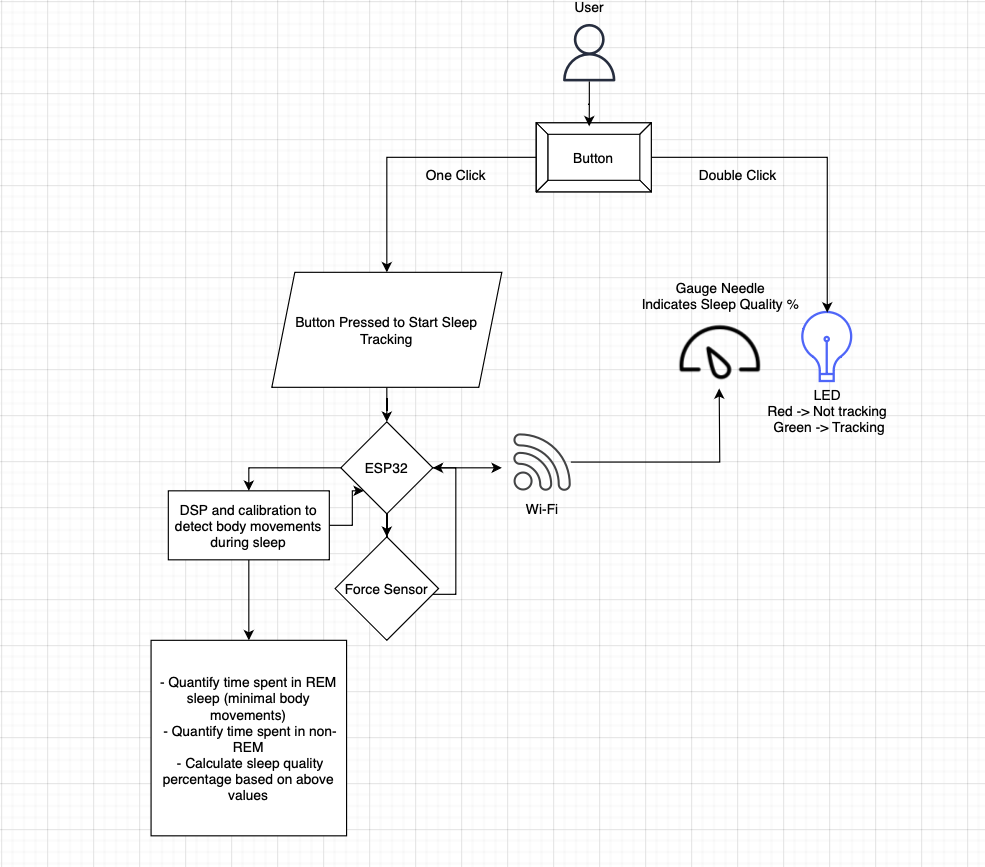

# Non-invasive Sleep Analysis Device

## Description
This device aims to provide a non-invasive way of tracking an individual's sleep quality. It will leverage a force sensor that is placed underneath a mattress to quantify time spent in Rapid Eye Movement (REM) and Non-Rapid Eye Movement (Non-REM) sleep. The user will be able to see their sleep quality once awake, through a stepper-motor controlled gauge needle that indicated sleep quality percentage, which ranges from 0-100%.

## Power Consumption Spreadsheet
[URL](https://docs.google.com/spreadsheets/d/1Ds0gf-FW2-m5mJB0DvBmWuOtr-a-fM6qRe99MvLTX7Y/edit#gid=1000455818)

# Processor
## Seeed Xiao ESP32 S3
This microcontroller has both Wi-Fi and bluetooth capabilties, combined with a small form factor which is ideal for this device. It has 2 pins that can be used for supplying voltage, either 5V or 3.3V.

# Sensor
## Force Sensor: Bolsen Tech FSR402
This is a force sensor, that essentially converts pressure applied against the sensor into changes in resistance. This can be placed underneath the mattress to identify and track body movement over the sleep tracking period. It can be used within a range of 10KG-100KG.

# Displays

## Button
The button will be used by the user to start/stop the sleep tracking. Additionally, it will be programmed to where a double click shows if the device is currently tracking sleep through the LED output.

## LED
The LED will be used to indicate whether the device is currently tracking sleep and will be activated by the button. Upon double clicking the button, red will indicate that the device is not tracking and green will indicate vice-versa.

## Stepper-motor Needle Gauge
The needle gauge will display the measure of sleep quality in percentage. This output is triggered when the user clicks the button to stop the sleep tracking.

## System Architecture Diagram

## Functionality Diagram

